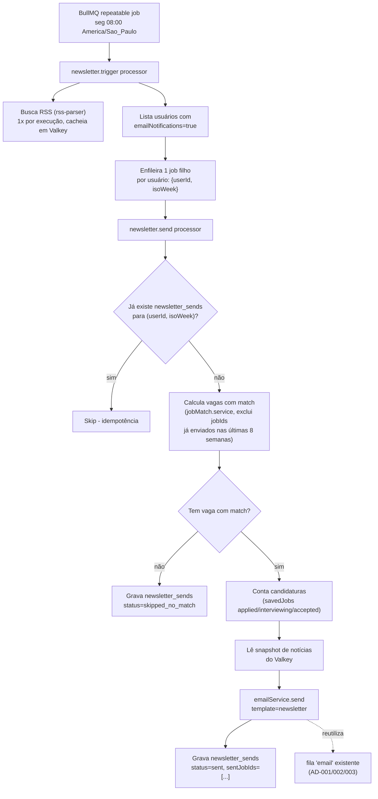

# Newsletter Semanal Design

**Spec**: `.specs/features/newsletter-semanal/spec.md`
**Status**: Approved

---

## Architecture Overview

Um job BullMQ repetível (`newsletter` queue) dispara toda segunda 08:00 (America/Sao_Paulo). O **trigger** busca as notícias RSS uma única vez por execução, lista os usuários elegíveis e enfileira um **job filho por usuário**. Cada filho calcula o conteúdo daquele usuário e delega o envio ao módulo de e-mail já existente (`src/modules/email`), que já resolve fila, retry e provider (AD-001/002/003).



---

## Code Reuse Analysis

### Existing Components to Leverage

| Component | Location | How to Use |
| --- | --- | --- |
| `EmailService.send` | `backend/src/modules/email/email.service.ts` | Único ponto de envio — o job filho chama `emailService.send({template: "newsletter", to, data})`, nunca fala com o provider direto (AD-001) |
| Fila/worker BullMQ do e-mail | `backend/src/modules/email/email.queue.ts`, `email.worker.ts` | Padrão de referência para a nova fila `newsletter` (conexão ioredis dedicada, `attempts`+`backoff` exponencial) |
| Templates react-email | `backend/src/modules/email/templates/{registry,BaseLayout,welcome}.tsx` | Novo template `newsletter.tsx` segue a mesma estrutura de `welcome.tsx` sobre `BaseLayout`; registrado em `registry.ts` |
| `getUserMatchTechnologies`, `scoreJobWithTechnologies` | `backend/src/modules/jobs/services/jobMatch.service.ts` | Motor de matching já existente — chamado diretamente (não via `JobProfileMatchService.enrich()`, que dispara notificação de alto match como efeito colateral indesejado aqui) |
| `cacheAbsoluteSMembers`, `cacheGetJobsByIds` | `backend/src/lib/cache.ts` | Leitura do índice global de vagas (Valkey) pra rodar o matching de cada usuário |
| `userPreferences.emailNotifications` | `backend/src/db/schema/userPreferences.ts` | Opt-out já existe ponta a ponta (schema + API + `PreferencesForm.tsx`); o job só **lê** esse campo, não recria UI |
| `generateSearchableHash`/`compareSearchableHash` (padrão) | `backend/src/lib/security/searchableHash.ts` | Modelo de convenção (HMAC + `timingSafeEqual`) pro novo utilitário de token de unsubscribe |
| `ENCRYPTION_MASTER_KEY` | `backend/src/lib/security/encryption.ts` (`getMasterKey`) | Chave derivada (HMAC com domain separation) pra assinar o token de unsubscribe — sem exigir novo secret obrigatório |
| Rotas públicas sem `ProtectedRoute` | `frontend/src/app/AppRoutes.tsx` (`/auth/callback`, `/politica-de-privacidade`) | Padrão confirmado pra registrar `/newsletter/unsubscribe` como rota pública nova |
| `savedJobs.status` | `backend/src/db/schema/savedJobs.ts` | Contagem de candidaturas (`applied`/`interviewing`/`accepted`) |

### Integration Points

| System | Integration Method |
| --- | --- |
| Fila `email` existente | Job filho da newsletter chama `emailService.send()` — nunca escreve na fila `email` diretamente |
| Valkey/BullMQ | Nova fila `newsletter` (conexão ioredis dedicada, mesmo padrão de `email.queue.ts`); snapshot de notícias RSS cacheado em `newsletter:news:{isoWeek}` (TTL 7 dias) pra não refazer fetch por usuário |
| Postgres (Drizzle) | Nova tabela `newsletter_sends` (controle de idempotência + histórico de vagas já enviadas) |
| RSS externo | Novo pacote `rss-parser` (v3.13.0, verificado via npm/GitHub — https://www.npmjs.com/package/rss-parser), chamado só pelo trigger, uma vez por execução |
| Frontend | Nova rota pública `/newsletter/unsubscribe`, mesmo padrão de `/auth/callback` (sem `ProtectedRoute`) |

---

## Components

### `newsletter.queue.ts`

- **Purpose**: Fila BullMQ `newsletter` + registro do job repetível semanal.
- **Location**: `backend/src/modules/newsletter/newsletter.queue.ts`
- **Interfaces**:
  - `getNewsletterQueue(): Queue` — singleton lazy, mesmo padrão de `getEmailQueue()`
  - `scheduleWeeklyTrigger(): Promise<void>` — registra o repeatable job (`pattern: "0 8 * * 1"`, `tz: "America/Sao_Paulo"`) com `jobId` fixo, chamado 1x no boot; BullMQ dedupa por jobId, então chamar de novo em cada deploy não duplica o agendamento
  - `enqueueUserSend(userId: string, isoWeek: string): Promise<void>`
  - `closeNewsletterQueue(): Promise<void>`
- **Dependencies**: `bullmq`, `ioredis` (conexão dedicada, mesmo padrão de `email.queue.ts`)
- **Reuses**: Estrutura de `email.queue.ts`

### `newsletter.worker.ts`

- **Purpose**: Worker BullMQ que processa dois tipos de job na fila `newsletter`: `trigger` (fan-out semanal) e `send-user` (por usuário).
- **Location**: `backend/src/modules/newsletter/newsletter.worker.ts`
- **Interfaces**:
  - `startNewsletterWorker(): Worker`
  - `stopNewsletterWorker(): Promise<void>`
- **Dependencies**: `newsletter.service.ts`, `newsletter.queue.ts`
- **Reuses**: Estrutura de `email.worker.ts` (log de falha em `worker.on("failed")`)

### `newsletter.service.ts`

- **Purpose**: Lógica de negócio — quem é elegível, cálculo de conteúdo por usuário, idempotência.
- **Location**: `backend/src/modules/newsletter/newsletter.service.ts`
- **Interfaces**:
  - `runWeeklyTrigger(): Promise<void>` — busca notícias 1x, lista elegíveis, enfileira filhos
  - `sendForUser(userId: string, isoWeek: string): Promise<void>` — idempotência + matching + envio
  - `getIsoWeek(date: Date): string` — ex.: `"2026-W36"`
- **Dependencies**: `jobMatch.service.ts`, `newsFeed.service.ts`, `emailService`, Drizzle (`users`, `userPreferences`, `savedJobs`, `newsletter_sends`)
- **Reuses**: `getUserMatchTechnologies`/`scoreJobWithTechnologies` (matching), `emailService.send` (envio)

### `newsFeed.service.ts`

- **Purpose**: Busca e normaliza itens de notícias tech via RSS.
- **Location**: `backend/src/modules/newsletter/newsFeed.service.ts`
- **Interfaces**:
  - `fetchTechNews(limit = 5): Promise<NewsItem[]>` — `Promise.allSettled` sobre os feeds configurados, timeout por feed, dedup por link, ordena por data desc, corta em `limit`. Feed indisponível/erro de parse é descartado silenciosamente (log `logWarn`), nunca lança.
- **Dependencies**: `rss-parser`
- **Reuses**: N/A (módulo novo)
- **Nota de verificação**: as URLs de feed concretas (candidatas: agregador de Hacker News, TabNews) **não foram testadas ao vivo nesta sessão** — só a biblioteca `rss-parser` foi verificada. Primeira tarefa da fase Execute deve validar reachability/formato antes de fixar a lista final em config.

### `unsubscribeToken.ts`

- **Purpose**: Gera/valida token opaco de unsubscribe sem exigir sessão.
- **Location**: `backend/src/lib/security/unsubscribeToken.ts`
- **Interfaces**:
  - `generateUnsubscribeToken(userId: string): string` — `base64url(userId) + "." + hmac`
  - `verifyUnsubscribeToken(token: string): string | null` — retorna `userId` se válido, `null` caso contrário (formato errado, HMAC não bate)
- **Dependencies**: `node:crypto` (`createHmac`, `timingSafeEqual`), `ENCRYPTION_MASTER_KEY` (via `getMasterKey`-equivalente, chave derivada com domain separation `"newsletter-unsubscribe"`)
- **Reuses**: Convenção de `searchableHash.ts` (HMAC + `timingSafeEqual`, sem novo secret obrigatório)

### Rota/controller de unsubscribe

- **Purpose**: Endpoint público que aplica o unsubscribe.
- **Location**: `backend/src/modules/newsletter/newsletter.controller.ts` + `backend/src/routes/newsletter.routes.ts` (montada em `app.ts` **sem** `requireAuth`)
- **Interfaces**:
  - `POST /api/newsletter/unsubscribe` — body `{ token: string }` → `verifyUnsubscribeToken` → `UPDATE user_preferences SET email_notifications=false WHERE user_id=...` → `200 { ok: true }`; token inválido → `200 { ok: false }` (nunca revela se o usuário existe — evita enumeração)
- **Dependencies**: `unsubscribeToken.ts`, Drizzle
- **Reuses**: Padrão de validação Zod dos outros controllers (`user.schemas.ts`)

### Template `newsletter.tsx` + página `/newsletter/unsubscribe`

- **Purpose**: Corpo do e-mail (react-email) e página de confirmação do unsubscribe.
- **Location**: `backend/src/modules/email/templates/newsletter.tsx` (registrado em `registry.ts`); `frontend/src/domains/newsletter/presentation/pages/UnsubscribePage.tsx` (registrada em `AppRoutes.tsx` como rota pública, mesmo padrão de `/auth/callback`)
- **Interfaces**: `NewsletterProps { name, matchedJobs, appliedCount, news, unsubscribeUrl, appUrl }`
- **Reuses**: `BaseLayout.tsx` (template), `PublicRoute`-free pattern do router (página)

---

## Data Models

### `newsletter_sends` (nova tabela Drizzle)

```typescript
interface NewsletterSend {
  id: string; // uuid
  userId: string; // uuid, FK users.id, on delete cascade
  isoWeek: string; // varchar(8), ex. "2026-W36"
  status: "sent" | "skipped_no_match"; // varchar(20)
  sentJobIds: string[]; // jsonb, default []
  createdAt: Date;
}
```

**Índices**: `unique(userId, isoWeek)` — garante idempotência (um envio por usuário por semana ISO); `index(userId, createdAt)` — suporta a query de "jobIds enviados nas últimas 8 semanas" pro dedup de frescor.

**Relationships**: `userId` → `users.id`. Sem relação com `savedJobs`/`applicationEvents` (o resumo de candidaturas é lido direto de `savedJobs`, não duplicado aqui).

---

## Error Handling Strategy

| Error Scenario | Handling | User Impact |
| --- | --- | --- |
| Todos os feeds RSS falham na execução | `fetchTechNews` retorna `[]`; e-mail é montado sem a seção de notícias | Nenhum — recebe o resto do conteúdo normalmente |
| Job filho falha (erro de DB, matching, etc.) | BullMQ re-tenta com backoff exponencial (mesmo padrão de `email.queue.ts`); falha final só loga (`logError`), não derruba os demais usuários | Usuário pode não receber naquela semana; não afeta outros |
| Usuário sem vaga com match | Grava `status="skipped_no_match"`, não envia e-mail | Nenhum e-mail (esperado, AC confirmado) |
| Reprocessamento da mesma semana (retry/crash do trigger) | `unique(userId, isoWeek)` impede segunda linha; job filho checa antes de enviar e sai cedo se já existe | Nunca recebe duplicata |
| Token de unsubscribe inválido/adulterado | `verifyUnsubscribeToken` retorna `null`; endpoint responde `{ok: false}` sem distinguir motivo | Página mostra "link inválido", sem vazar se o usuário existe |
| Usuário excluído (LGPD, PAV-41) entre enfileirar e processar o job filho | Query por `userId` não encontra linha em `users`/`userPreferences` → job trata como "usuário não encontrado", loga aviso e sai sem erro | Nenhum — não derruba o restante do fan-out |

---

## Risks & Concerns

| Concern | Location (file:line) | Impact | Mitigation |
| --- | --- | --- | --- |
| Sem timestamp confiável de "vaga adicionada" no catálogo | `scraper-go/internal/domain/job.go:12` (`PostedAt` é string crua, opcional); nenhum campo `indexedAt` em `cacheGetJobsByIds` (`backend/src/lib/cache.ts:379`) | Impossível filtrar literalmente "últimos 7 dias" como o card sugere | Pivô de design confirmado com o usuário: dedup por "ainda não enviado ao usuário" (`newsletter_sends.sentJobIds`, lookback 8 semanas) em vez de filtro por data |
| `JobProfileMatchService.enrich()` teria efeito colateral indesejado | `backend/src/modules/jobs/services/jobProfileMatch.service.ts:43-71` (`notifyHighMatches`) | Rodar a newsletter dispararia notificações de "alto match" não relacionadas | Newsletter chama `jobMatch.service.ts` (funções de baixo nível) direto, não `enrich()` |
| Índice global de vagas pode ser grande | `cacheAbsoluteSMembers("scraper:jobs:index")` + `cacheGetJobsByIds` (`backend/src/lib/cache.ts:118,379`) | Buscar o índice inteiro por execução (1x, não por usuário) pode ficar pesado se o catálogo crescer muito | Fetch único por execução (não por usuário); dimensionar custo real na fase Tasks/Execute quando soubermos a cardinalidade atual do índice |
| URLs de feed RSS não testadas ao vivo nesta sessão | `newsFeed.service.ts` (novo) | Feed escolhido pode não existir/mudar de formato | Primeira tarefa de Execute valida reachability antes de fixar config; biblioteca (`rss-parser`) já verificada, só as URLs ficaram pendentes |
| PAV-125 (índice determinístico por família no Valkey) ainda bloqueado | Linear PAV-125 | Se essa epic mudar o formato do cache de vagas, o matching da newsletter pode precisar de ajuste | Este design não depende de PAV-125 de propósito, pra não acoplar a um card bloqueado; revisitar quando PAV-125 sair do backlog |

---

## Tech Decisions (only non-obvious ones)

| Decision | Choice | Rationale |
| --- | --- | --- |
| Scheduling primitive | BullMQ repeatable job (fila dedicada `newsletter`) | Consistente com AD-002 (fila já é o mecanismo assíncrono do projeto); sem nova dependência de infra (nada de cron de SO/serviço novo no compose) |
| Arquitetura do job | Trigger + fan-out por usuário (2 tipos de job na mesma fila) | Confirmado com o usuário — resiliência e observabilidade por usuário, mesmo espírito de retry/backoff do módulo de e-mail |
| Proxy de "frescor" das vagas | Dedup por histórico de envio (`sentJobIds`, lookback 8 semanas) em vez de filtro por data de postagem | Não existe timestamp confiável por vaga (ver Risks); resultado prático equivalente (conteúdo sempre novo) |
| Motor de matching | Chamar `jobMatch.service.ts` direto, não `JobProfileMatchService.enrich()` | Evita efeito colateral de notificação de alto match |
| Unsubscribe sem login | Token HMAC (chave derivada de `ENCRYPTION_MASTER_KEY` com domain separation), não JWT | Não há `jsonwebtoken` no projeto; HMAC+`timingSafeEqual` já é o padrão estabelecido (`searchableHash.ts`) pra esse tipo de capability token |
| Página de unsubscribe | Nova rota pública no `AppRoutes.tsx`, sem `ProtectedRoute` | Padrão já existe (`/auth/callback`, `/politica-de-privacidade`) — usuário deslogado precisa conseguir acessar |
| Nova dependência | `rss-parser` (npm, v3.13.0) | Única lib madura leve pra RSS no ecossistema Node; verificada via npm/GitHub nesta sessão |

> **Decisões de projeto candidatas a `STATE.md`** (propor ao usuário após aprovação deste design): "jobs agendados/recorrentes no backend usam BullMQ repeatable job, nunca cron de SO" e "links de ação sem login usam token HMAC com chave derivada de `ENCRYPTION_MASTER_KEY`, seguindo o padrão de `searchableHash.ts`". Ambas reutilizáveis por features futuras.
