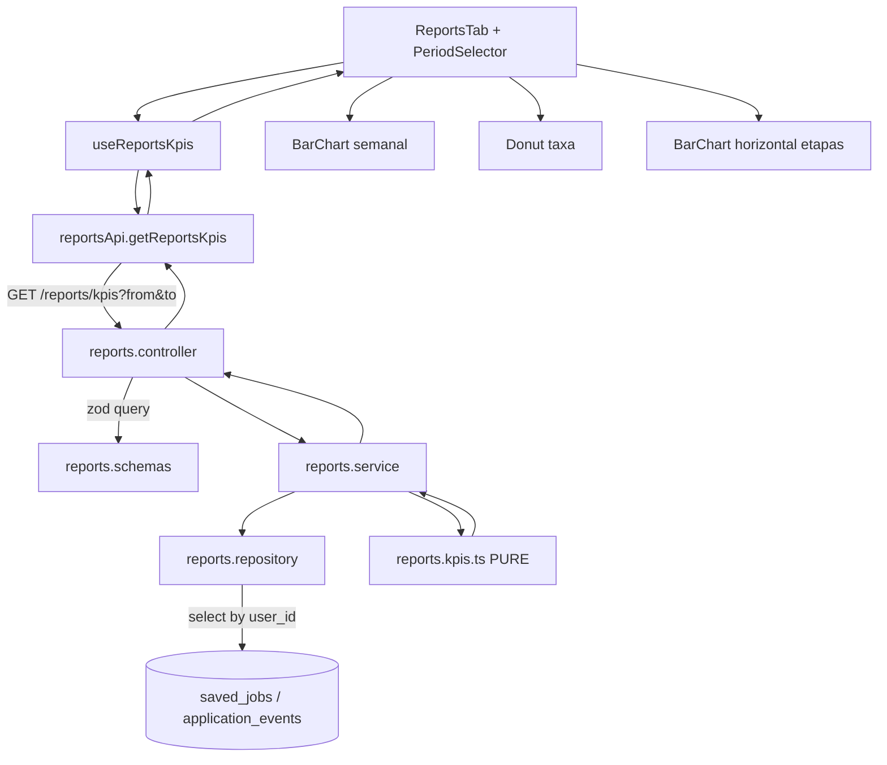

# Relatórios/KPIs do candidato — Design

**Spec**: `.specs/features/relatorios-kpis/spec.md`
**Status**: Draft

---

## Architecture Overview

Cálculo **on-read**, sem persistência de agregados. O backend ganha um módulo `reports` com um **núcleo puro** (`reports.kpis.ts`) que recebe linhas cruas (`saved_jobs` + `application_events` do usuário) e devolve o `KpiReport`. Repositório faz duas queries indexadas por `user_id`; controller resolve sessão + valida query com Zod. O frontend ganha a seção `/relatorios` no `new_dashboard` (mesmo shell/rota/guard das outras abas), com um hook de fetch e três gráficos Recharts.



---

## Code Reuse Analysis

### Existing Components to Leverage

| Componente | Local | Como usar |
| --- | --- | --- |
| Padrão router→controller→service | `src/routes/savedJobs.routes.ts`, `src/modules/savedJobs/*` | Espelhar estrutura e o `router.get((req,res,next)=>{ ctrl.x(req,res).catch(next) })`. |
| `validate({ query })` | `src/middleware/validate.ts` | Middleware para o schema Zod da query (`from`/`to`). |
| Sessão + auth | `app.ts` (`withSession, requireAuth`), `SavedJobsController.requireUserId` via `getIronSession<Session>` | Mesmo mecanismo; `reports.controller` extrai `session.userId` e lança `AppError.unauthorized()`. |
| `AppError` + `errorHandler` + `AppError.fromZodError` | `src/lib/errors.ts`, `src/middleware/errorHandler.ts` | 400/401 saem no formato padrão da API. |
| `ownedBy` / filtro por `userId` | `src/lib/authorization/ownership.ts` | Repositório filtra por `user_id` (isolamento — KPI-06). |
| Schema Drizzle | `src/db/schema/savedJobs.ts`, `src/db/schema/applicationEvents.ts` | Fonte dos dados; `jobStatusEnum`, `ApplicationEvent`, `SavedJob`. Índice `application_events_saved_job_id_created_at_idx` já existe. |
| `count()` / `select` agregado | `src/modules/admin/dashboard/dashboard.repository.ts` | Referência de estilo (mas aqui buscamos linhas e agregamos no core puro). |
| `BACKEND.md` §Segurança/rotas | `BACKEND.md` | Adicionar a rota `/reports/kpis` na doc. |
| Shell do dashboard | `new_dashboard/NewDashboardPage.tsx` (`getSection`, `renderContent`), `layout.tsx`, `AppRoutes.tsx` | Adicionar `"relatorios"` a `getSection`, um `case` em `renderContent`, e `<Route path="/relatorios" .../>` reusando `dashboardElement`. |
| Navegação | `components/layout/Sidebar.tsx` (`items`), `components/layout/MobileTabBar.tsx` (`tabs`), `components/shared/Icons.tsx` | Novo item "Relatórios" + ícone. |
| Adapter de API + Zod | `infrastructure/userDashboardApi.ts`, `infrastructure/dashboardJobsApi.ts` | Espelhar: `api.get`, schema Zod de resposta, função `toReportsKpis`. |
| Hook de dados | `hooks/useUserDashboardData.ts`, `hooks/useDashboardJobs.ts` | Padrão `useState` + `useEffect` + `isLoading`/`error` + `Promise` handling. |
| `api` client | `shared/lib/apiClient.ts` | `api.get("/reports/kpis", { params })`. |
| Estilo de barra/tile | `components/home/StatusCounters.tsx` (`CounterCard`), `components/dashboard/DashboardTab.tsx` (funil) | Tiles de sumário (P3) e fallback visual. |
| Padrão de teste backend | `tests/integration/routes/savedJobs.routes.test.ts` (mock service + iron-session + supertest) | Teste de integração da rota. |
| Padrão de teste frontend | `tests/unit/new_dashboard/api.test.ts`, `hooks.test.tsx`, `page.test.tsx` | Testes de adapter, hook e componente (mock `@/shared/lib/apiClient` / adapter). |

### Integration Points

| Sistema | Método de integração |
| --- | --- |
| Express app | `app.use("/reports", withSession, requireAuth, reportsRoutes)` em `src/app.ts` (junto dos outros mounts). |
| Postgres (Drizzle) | 2 `select` por `user_id`: `saved_jobs` (id, status, appliedAt, createdAt) e `application_events` (savedJobId, fromStatus, toStatus, createdAt, id). Sem migração — nenhuma coluna nova. |
| React Router | `<Route path="/relatorios">` reusa `dashboardElement` (guard `ProtectedRoute`). |
| Vite dev proxy | Adicionar `reports` ao regex `^/(auth|users|jobs|keywords|saved-jobs)` em `vite.config.ts` (consistência; o `apiClient` usa baseURL absoluta, então não é bloqueante). |

---

## Components

### `reports.kpis.ts` (núcleo puro) ⭐

- **Purpose**: Transformar linhas cruas de `saved_jobs` + `application_events` em `KpiReport` para uma janela `[from, to]`. Sem I/O, sem Date.now, determinístico.
- **Location**: `backend/src/modules/reports/reports.kpis.ts`
- **Interfaces**:
  - `computeKpis(input: KpiInput): KpiReport`
    - `KpiInput = { savedJobs: KpiSavedJob[]; events: KpiEvent[]; from: Date; to: Date }`
    - `KpiSavedJob = { id: string; status: JobStatus; appliedAt: Date | null; createdAt: Date }`
    - `KpiEvent = { savedJobId: string; fromStatus: JobStatus; toStatus: JobStatus; createdAt: Date; id: string }`
  - `isoWeekLabel(d: Date): string` → `"YYYY-Www"` (UTC, ISO-8601: semana 1 contém a primeira quinta-feira; segunda = início).
  - `isoWeekStart(d: Date): string` → `"YYYY-MM-DD"` da segunda-feira (UTC) da semana de `d`.
  - (helpers privados: `startOfIsoWeekUTC`, `diffDays`.)
- **Dependencies**: só `JobStatus` de `db/schema/savedJobs`.
- **Reuses**: nada externo (evita dependência de date lib — backend não tem nenhuma).
- **Algoritmo** (ver "Data Models" + "Algoritmo de agregação" abaixo).

### `reports.repository.ts`

- **Purpose**: Buscar as linhas do usuário para o core.
- **Location**: `backend/src/modules/reports/reports.repository.ts`
- **Interfaces**:
  - `fetchUserActivity(userId: string): Promise<{ savedJobs: KpiSavedJob[]; events: KpiEvent[] }>`
- **Dependencies**: `db` (`db/client`), schema.
- **Detalhe**: `db.select({...}).from(savedJobs).where(eq(savedJobs.userId, userId))` e idem `applicationEvents`, este `orderBy(asc(createdAt), asc(id))`. Busca **todos** os eventos/vagas do usuário (volume baixo por spec) — o recorte por janela acontece no core, porque durações precisam do evento anterior a `from`.
- **Reuses**: padrão de `dashboard.repository.ts`.

### `reports.service.ts`

- **Purpose**: Orquestrar repo + core; normalizar a janela.
- **Location**: `backend/src/modules/reports/reports.service.ts`
- **Interfaces**:
  - `getKpis(userId: string, range: { from: Date; to: Date }): Promise<KpiReport>`
- **Dependencies**: `ReportsRepository`, `computeKpis`.
- **Detalhe**: injeção opcional no construtor (`constructor(private repo = new ReportsRepository())`) p/ teste, espelhando `SavedJobsService(tx = db)`.

### `reports.schemas.ts`

- **Purpose**: Validar/transformar a query.
- **Location**: `backend/src/modules/reports/schemas/reports.schemas.ts`
- **Interfaces**:
  - `reportsKpisQuerySchema` — objeto Zod:
    - `from?: string` e `to?: string`, cada um `regex(/^\d{4}-\d{2}-\d{2}$/)` + `refine` de data real.
    - `.transform` → `{ from: Date; to: Date }` aplicando defaults e limites: `to` default = hoje (UTC, 23:59:59.999); `from` default = `to - 90 dias` (00:00:00.000). Datas passadas são ancoradas: `from`→00:00:00.000Z, `to`→23:59:59.999Z.
    - `.refine(from <= to, "from não pode ser depois de to")` → 400 via `AppError.fromZodError`.
  - `type ReportsKpisQuery = { from: Date; to: Date }`
- **Nota**: como `default`/`transform` dependem de "hoje", o schema é uma **função** `buildReportsKpisQuerySchema(now = new Date())` exportada, e a instância default `reportsKpisQuerySchema = buildReportsKpisQuerySchema()` — permite teste determinístico.

### `reports.controller.ts`

- **Purpose**: Sessão → userId → chama service → `res.json`.
- **Location**: `backend/src/modules/reports/reports.controller.ts`
- **Interfaces**:
  - `getKpis(req, res): Promise<Response>`
- **Dependencies**: `getIronSession<Session>`, `sessionOptions`, `ReportsService`, `AppError`.
- **Detalhe**: `req.query` já vem validado/transformado pelo `validate({ query })` — mas `validate` redefine `req.query` com o objeto parseado, então o controller lê `req.query as unknown as ReportsKpisQuery`. Sem sessão → `throw AppError.unauthorized()` (401, antes de qualquer agregação — KPI-07).

### `reports.routes.ts`

- **Location**: `backend/src/routes/reports.routes.ts`
- **Conteúdo**: `router.get("/kpis", validate({ query: reportsKpisQuerySchema }), (req,res,next) => controller.getKpis(req,res).catch(next))`. Export `reportsRoutes`.

### Frontend: `reportsApi.ts`

- **Location**: `frontend/src/domains/new_dashboard/infrastructure/reportsApi.ts`
- **Interfaces**:
  - `getReportsKpis(params: { from?: string; to?: string }): Promise<ReportsKpis>`
  - `ApiReportsKpisSchema` (Zod, `passthrough` defensivo) + `toReportsKpis(data): ReportsKpis`
- **Reuses**: `api` de `apiClient`, padrão Zod de `userDashboardApi.ts`.

### Frontend: `useReportsKpis.ts`

- **Location**: `frontend/src/domains/new_dashboard/hooks/useReportsKpis.ts`
- **Interfaces**:
  - `useReportsKpis(): { data: ReportsKpis | null; isLoading: boolean; error: string | null; period: PeriodPreset; setPeriod: (p) => void; reload: () => void }`
- **Detalhe**: `period` default `"90d"`; `useEffect` sobre `period` → resolve `{from,to}` (helper `periodToRange(preset)` no client, `"tudo"` → `{}`) → `getReportsKpis` → seta `data`/`error`. `reload` re-dispara.
- **Reuses**: padrão de `useUserDashboardData.ts` (`isMounted`, `Promise` try/catch, `onError`).

### Frontend: `ReportsTab.tsx` + subcomponentes

- **Location**: `frontend/src/domains/new_dashboard/components/reports/`
  - `ReportsTab.tsx` — layout, orquestra hook, estados loading/empty/error, header com `PeriodSelector`.
  - `PeriodSelector.tsx` — 4 botões (`30d` / `90d` / `12m` / `Tudo`), controlado.
  - `WeeklyApplicationsChart.tsx` — Recharts `BarChart` vertical (`weeklyApplications`). Empty state se `[]`.
  - `InterviewRateChart.tsx` — Recharts `PieChart` donut (valor + resto até 100) + label central `%`. Se `insufficientData` → empty state.
  - `StageDurationsChart.tsx` — Recharts `BarChart` `layout="vertical"` (barras horizontais), 3 categorias; etapa `null` → linha "—" sem barra (KPI-16).
  - `ReportsSummary.tsx` (P3) — 3 tiles reusando visual de `CounterCard`.
- **Recharts import**: `React.lazy(() => import("./components/reports/ReportsTab"))` no `NewDashboardPage` para não pesar o bundle das outras abas; `Suspense` com o mesmo `Loading` já usado.
- **Reuses**: `CounterCard` (copiar estilo), tokens/tailwind existentes, `cn`.

### Wiring do dashboard

- `AppRoutes.tsx`: `<Route path="/relatorios" element={dashboardElement} />`.
- `NewDashboardPage.tsx`: `getSection` → `if (pathname.startsWith("/relatorios")) return "relatorios";`; `renderContent` → `case "relatorios": return <Suspense fallback={<Loading/>}><ReportsTab/></Suspense>;`.
- `Sidebar.tsx`: `items` += `{ label: "Relatórios", to: "/relatorios", icon: Icons.Relatorios }`.
- `MobileTabBar.tsx`: hoje tem 4 tabs num `grid-cols-4`. Adicionar "Relatórios" → `grid-cols-5` (ou mover para o padrão de 5). Ajuste mínimo de classe.
- `Icons.tsx`: novo `Relatorios` (ícone de barra/gráfico — reusar set `lucide-react` já importado, ex. `BarChart3`).

---

## Data Models

### `KpiReport` (resposta da API)

```typescript
interface KpiReport {
  range: { from: string; to: string }; // "YYYY-MM-DD", janela normalizada (KPI-09)
  weeklyApplications: Array<{
    week: string;      // "2026-W36"
    weekStart: string; // "2026-08-31" (segunda, UTC)
    count: number;     // > 0 (semanas sem candidatura são omitidas — KPI-02)
  }>;
  interviewRate: {
    value: number;           // inteiro 0..100 (KPI-03)
    insufficientData: boolean; // true quando denominador = 0 (KPI-04)
  };
  stageDurations: {
    savedToApplied: number | null;        // dias, 1 casa decimal (KPI-05)
    appliedToInterviewing: number | null;
    interviewingToOutcome: number | null; // interviewing → rejected|accepted
  };
}
```

Frontend `ReportsKpis` = mesma forma (tipos TS espelhados no adapter).

---

## Algoritmo de agregação (`computeKpis`)

Entrada normalizada: `from` = `YYYY-MM-DDT00:00:00.000Z`, `to` = `YYYY-MM-DDT23:59:59.999Z`.

1. **Index de eventos por vaga**: `Map<savedJobId, KpiEvent[]>`, cada lista ordenada por `(createdAt asc, id asc)`.
2. **Momento de submissão por vaga** (`submittedAt: Date | null`):
   - Se existe evento com `fromStatus === "saved"` → `submittedAt = ` `createdAt` do **primeiro** deles.
   - Senão, se `job.status !== "saved"` → `submittedAt = job.appliedAt ?? job.createdAt` (dado legado sem trilha).
   - Senão → `null` (ainda é só "saved", não é candidatura).
3. **`weeklyApplications`** (KPI-02, KPI-04):
   - `submitted = savedJobs.filter(j => submittedAt(j) !== null && from <= submittedAt(j) <= to)`.
   - Agrupar `submitted` por `isoWeekStart(submittedAt)`. Para cada grupo não-vazio: `{ week: isoWeekLabel, weekStart, count }`.
   - Ordenar por `weekStart` asc. `sum(count) === submitted.length` (invariante testável).
4. **`interviewRate`** (KPI-03, KPI-04):
   - `denom = submitted.length`.
   - `reached(j) = eventsOf(j).some(e => e.toStatus === "interviewing") || j.status === "interviewing"`.
   - `numer = submitted.filter(reached).length`.
   - `denom === 0` → `{ value: 0, insufficientData: true }`.
   - senão → `{ value: Math.round((numer / denom) * 100), insufficientData: false }`.
5. **`stageDurations`** (KPI-05, edge cases):
   - Para cada vaga: estado `cur = "saved"`, `enteredAt = job.createdAt`.
   - Para cada evento `e` (em ordem): se `e.createdAt` ∈ `[from, to]` **e** o par `(cur → e.toStatus)` é rastreado, empurrar `diffDays(e.createdAt, enteredAt)` no balde:
     - `saved → applied` → balde `savedToApplied`
     - `applied → interviewing` → balde `appliedToInterviewing`
     - `interviewing → rejected` **ou** `interviewing → accepted` → balde `interviewingToOutcome`
   - depois: `cur = e.toStatus`, `enteredAt = e.createdAt` (sempre, mesmo se par não rastreado — ex.: `saved → interviewing` direto só avança o estado).
   - Guard: se `e.fromStatus !== cur` (trilha inconsistente), confiar em `e.fromStatus` para o rótulo do par mas manter `enteredAt` — na prática `e.fromStatus === cur` sempre pelo `update()` atual.
   - Resultado por balde: `round(mean * 10) / 10` se houver ≥1 amostra, senão `null`.
   - `diffDays(a, b) = (a.getTime() - b.getTime()) / 86_400_000`.
6. **`range`**: `{ from: from.toISOString().slice(0,10), to: to.toISOString().slice(0,10) }`.

### Helpers de semana ISO (UTC)

- `startOfIsoWeekUTC(d)`: copia `d` zerando hora (UTC); `day = getUTCDay()` (0=dom); `delta = (day === 0 ? -6 : 1 - day)`; `setUTCDate(date + delta)`.
- `isoWeekStart(d)` = `startOfIsoWeekUTC(d).toISOString().slice(0,10)`.
- `isoWeekLabel(d)`: algoritmo ISO-8601 padrão — pega a quinta-feira da semana (`startOfIsoWeekUTC(d) + 3` dias), ano dela = ano ISO; semana = `floor((thursday - startOfIsoWeekUTC(jan 4 daquele ano)) / 7dias) + 1`; formata `${isoYear}-W${String(week).padStart(2,"0")}`.

---

## Error Handling Strategy

| Cenário | Tratamento | Impacto p/ usuário |
| --- | --- | --- |
| Sem sessão (`session.userId` ausente) | `reports.controller` lança `AppError.unauthorized()` antes de tocar o service (KPI-07) | 401; frontend (guard) já teria redirecionado ao login |
| `from`/`to` mal formados ou `from > to` | `validate({ query })` → `AppError.fromZodError` (KPI-08) | 400 com mensagem de validação; UI mostra error state |
| Usuário sem dados | Core devolve estruturas zeradas, 200 (KPI-04) | UI: empty state por card, sem erro |
| Falha de DB | Propaga p/ `errorHandler` (500) | UI: error state com "tentar novamente" (KPI-15) |
| Recharts falha ao carregar (lazy import) | `Suspense`/error boundary local no `case "relatorios"` | fallback textual; resto do dashboard intacto (KPI-15) |
| Resposta com shape inesperado | `ApiReportsKpisSchema` (`passthrough` + campos opcionais tolerantes) → `toReportsKpis` normaliza | UI não quebra; campos ausentes viram `null`/`[]` |

---

## Risks & Concerns

| Concern | Local | Impacto | Mitigação |
| --- | --- | --- | --- |
| Cálculo de semana ISO à mão (sem date lib no backend) | `reports.kpis.ts` (novo) | Bug de off-by-one em virada de ano / semana 53 → rótulo errado | Testes unitários dedicados aos helpers com casos de borda (1º/4 jan, 31 dez, semana 53 de 2026, ano bissexto); algoritmo ISO-8601 canônico documentado acima |
| `fetchUserActivity` busca todos os eventos/vagas do usuário | `reports.repository.ts` (novo) | Usuário com histórico enorme → payload/CPU cresce linear | Volume real é baixo (spec, Out of Scope: dezenas–centenas). Query é indexada por `user_id`. Follow-up: recorte por janela + índice `application_events(user_id, created_at)` se virar gargalo — registrar nota no PR |
| `application_events` não tem índice por `user_id` isolado (só `(saved_job_id, created_at)`) | `src/db/schema/applicationEvents.ts:47` | `select ... where user_id = ?` faz seq scan em tabelas grandes | Mesmo argumento de volume. Não adicionar migração neste card (mantém "direto"); anotar como follow-up |
| `MobileTabBar` fixa em `grid-cols-4` | `components/layout/MobileTabBar.tsx:31` | 5º item quebra o layout mobile | Mudar para `grid-cols-5` e revisar truncamento dos labels no teste de componente |
| `appliedAt` só é setado se o cliente mandar no `PATCH` (nunca automático) | `src/modules/savedJobs/savedJobs.service.ts:74-83` | KPI de "candidatura submetida" não pode depender de `appliedAt` | Já mitigado no design: fonte primária é o evento `from_status='saved'`; `appliedAt` só entra no fallback legado |
| Sem teste de componente no `new_dashboard` hoje | `frontend/tests/unit/new_dashboard/` | Sem baseline de padrão p/ testar Recharts em jsdom | Recharts em jsdom precisa de container com tamanho — usar `ResponsiveContainer` com `width`/`height` fixos em teste OU mockar `ResponsiveContainer`; testar dados via props e presença de labels/acessibilidade, não pixels |

---

## Tech Decisions (only non-obvious ones)

| Decisão | Escolha | Racional |
| --- | --- | --- |
| Onde vive a lógica de KPI | Função pura `computeKpis` isolada de I/O | ACs são sobre valores calculados; testar puro com fixtures é fiel à spec e não espelha implementação (evita testes mock-heavy tipo `dashboard.repository.test.ts`) |
| Janela vs. dado bruto | Repo busca tudo do usuário; core recorta | Durações de etapa precisam do evento imediatamente anterior a `from` |
| Semanas sem candidatura | Omitidas da série (não zero-fill) | KPI-02 pede item "por semana com ≥1 candidatura" e soma consistente; zero-fill seria decisão de UI, fica no gráfico se quiser |
| Schema Zod como factory | `buildReportsKpisQuerySchema(now)` | `default`/`transform` dependem de "hoje" — factory permite teste determinístico |
| Recharts lazy | `React.lazy` só no `case "relatorios"` | Não penaliza o bundle das abas Home/Dashboard/Vagas |
| "atingiu interviewing" | evento `toStatus==='interviewing'` OU `status` atual `=== 'interviewing'` | Cobre vaga que passou e saiu (evento existe) e vaga legada parada em interviewing sem trilha |
| Agrupar `interviewing→rejected` e `interviewing→accepted` | Um balde `interviewingToOutcome` | Evita duas barras quase sempre com 0–1 amostra; "tempo até desfecho da entrevista" é a métrica útil |

> Nenhuma decisão aqui vira convenção de projeto nova — não há `AD-NNN` a adicionar. Padrões seguem os já estabelecidos (router/controller/service, adapter Zod, hook de fetch).

---

## Test Coverage Matrix

| Req | Teste | Nível | Arquivo |
| --- | --- | --- | --- |
| KPI-01 | GET sem query → 200, shape completo, janela = 90d | Integração | `tests/integration/routes/reports.routes.test.ts` |
| KPI-02 | série: 1 item/semana não-vazia, ordenada, `sum(count)===total` | Unit (core) | `tests/unit/modules/reports/reports.kpis.test.ts` |
| KPI-03 | taxa = round(Y/X*100), `insufficientData=false` | Unit (core) | idem |
| KPI-04 | sem candidatura → `[]` + `{value:0,insufficientData:true}` | Unit (core) + Integração | idem + route test |
| KPI-05 | 3 chaves, média em dias 1 casa, `null` sem transição | Unit (core) | idem |
| KPI-06 | dados de outro `user_id` não entram | Unit (repo, mock db) + Integração (service mock recebe userId da sessão) | `reports.repository.test.ts` / route test |
| KPI-07 | sem sessão → 401, service não chamado | Integração | route test |
| KPI-08 | `from`/`to` inválido, `from>to` → 400, service não chamado | Integração | route test |
| KPI-09 | `?from&to` → `range` ecoado normalizado, janela `[00:00Z,23:59:59.999Z]` | Unit (schema) + Integração | `reports.schemas.test.ts` + route test |
| KPI-10 | `/relatorios` renderiza item ativo na sidebar/tabbar; rota sob guard | Unit (componente) | `tests/unit/new_dashboard/reports.test.tsx` |
| KPI-11 | monta → chama adapter com range default, mostra loading | Unit (hook) | idem (`useReportsKpis`) |
| KPI-12 | resposta com dados → 3 gráficos presentes | Unit (componente) | idem |
| KPI-13 | trocar preset → nova chamada com novos `from/to`, re-render | Unit (hook + componente) | idem |
| KPI-14 | resposta vazia → empty state por card (não gráfico vazio) | Unit (componente) | idem |
| KPI-15 | erro → estado de erro + "tentar novamente" chama reload | Unit (componente) | idem |
| KPI-16 | etapa `null` → "—", não `0` | Unit (componente `StageDurationsChart`) | idem |
| KPI-17 | 3 tiles: soma da série, taxa, semana mais ativa (ou "—") | Unit (componente `ReportsSummary`) | idem |
| helpers | `isoWeekLabel`/`isoWeekStart`: 1º jan, 31 dez, semana 53/2026, virada de ano | Unit (core) | `reports.kpis.test.ts` |

---

## Out-of-band notes

- **Sem migração de banco.** Nenhuma coluna nova.
- **`BACKEND.md`**: adicionar `/reports/kpis` à lista de rotas e uma linha na seção relevante.
- **`package.json` (frontend)**: `+ recharts` (dependência de runtime).
- **Commits**: português, conventional, sem co-author (instrução do usuário).
